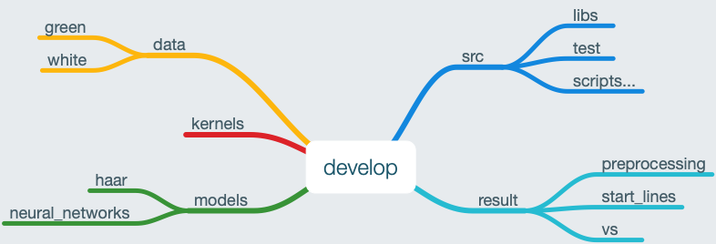
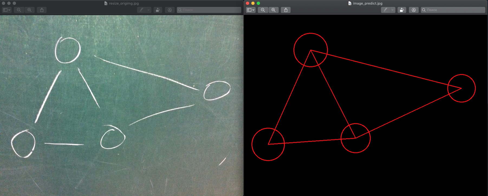
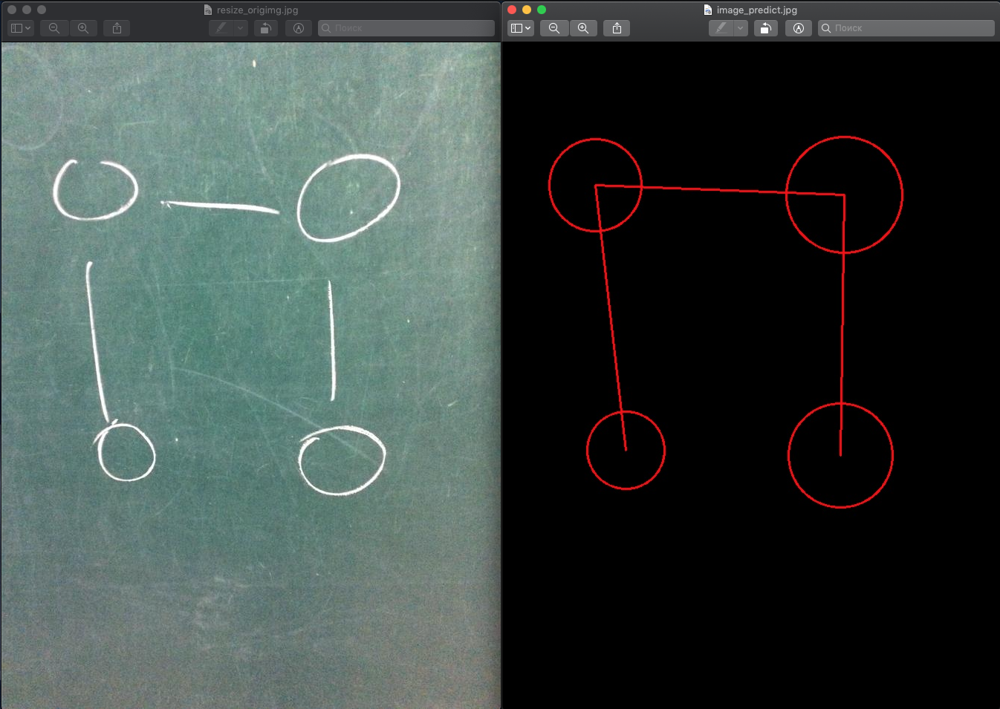

# NeiroGraph
## Course project

## Algorithm
<image src='./info/resal.jpg'>

## Steps
- [x] **Convert into black/white image**
- [x] **Search vertex**
  - [x] Haar_Cascade
  - [x] Filter neural network
  - [x] Additional filter
- [x] **Tracker edge detection**
  - [x] Tracker run
  - [x] Tracker shoot
  - [ ] **Сrossing lines**
- [ ] **Text recognition**

## Structure of repository

## Some results
### The first graph

### The second graph

