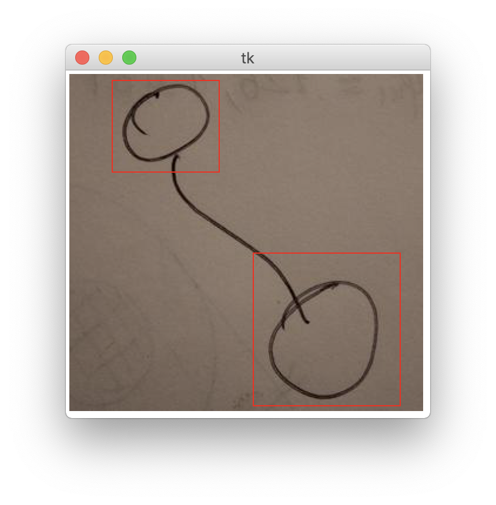

# NeiroGraph
## Course project

## markup2.py
### Description
Program help you to mark up your dataset's samples.

### Example


### Control
- ESC - **delete last rectangle**
- ENTER - **next image**
- Use your **cursor** to start draw rectangles

### Run the script
```
$ python markup2.py PRED_POS YOUR_NAME_FOLDER
```
After run the script you should answer 2 questions:
Enable messages in terminal? [Y/n]
Generate .dat file? [Y/n]

### .dat file
- good.dat
- bad.dat

### Attention
#### If you answer on the last question __yes__, you should rename you folder.
#### In PRED_POS directory you should copy your data(images) to process


## markup.py
### Description
Program help you to make mark up to your good/bad samples.
It is the similar program like as **markup2.py** but without **generating .dat files**.

### Control
- ESC - delete last rectangle
- ENTER - next image
- Use your cursor to start draw rectangles

### Run the script
```
$ python markup.py PRED_POS YOUR_NAME_FOLDER
```

# Back to Menu
- [BACK to Menu](https://github.com/iu8-nn-2018/NeiroGraph/tree/Steps-of-project-and-description)
