## КУРСОВОЙ ПРОЕКТ

## Оцифровка графов

**Разработчик проекта:**
Ромакин Д.В.

## Оглавление
1. Введение
2. Цели задачи и методы решения
  * Цели
  * Задачи
  * Методы решения
3. Актуальность
4. Описание работы системы
  * Этапы
  * Предобработка
    - Фильтрация с помощью сверточных ядер
    - Итоговая программа предобработки изображения
  * Поиск вершин графа
    - Почему каскады Хаара?
    - Simple Blob Detector
    - MSER Blob Detector
    - Hough Circles
    - Каскады Хаара
      + Подготовка данных
      + Обучение признаков Хаара
      + Выбор обученной модели Хаара
    - Фильтр СНС
    - Дополнительный фильтр пересечений
  * Распознавание линий
    - Поиск начал линий
      + Поиск начал линий с помощью Каскадов Хаара
      + Поиск начал линий с помощью HoughCirclesP
    - Поиск пересечений линий с помощью Каскадов Хаара
    - Tracker
      + Поиск начал линий
      + Движение Tracker
        * Условие соединенности вершин
        * Как движется Tracker
        * Что происходит при различных выходах в пункте 4
      + Tracker Shoot
      + Основные проблемы и их решения
  * Выводы
  * Литература
  * Приложение
    - Используемые технологии и их описание

## Введение

## Цели, задачи и методы решения

### *Цели:*

Создание программного обеспечения для оцифровки нарисованных графов на
изображении.

### *Задачи:*

-   автономность устройства, то есть работа программы без вмешательства
    человека

-   возможность просмотра промежуточных результатов в процессе работы
    программы

-   простой интерфейс

-   корректное выполнение программы

### *Методы решения:*

-   Python и необходимые библиотеки (keras, OpenCV, etc)

-   GCP: Google Cloud Platform

-   IDE: PyCharm

### *Актуальность:*

В современном мире технологии очень быстро развиваются. Многие процессы
автоматизируются с помощью нейронных сетей и искусственного интеллекта.
Эта отрасль активно развивается с каждым днем, поэтому ее важность
возрастает. С каждым годом усложняются технологии и возможности
нейронных сетей увеличиваются.

Мой проект помогает изучить основы машинного обучения для понимания его
работы.

**Описание работы системы**
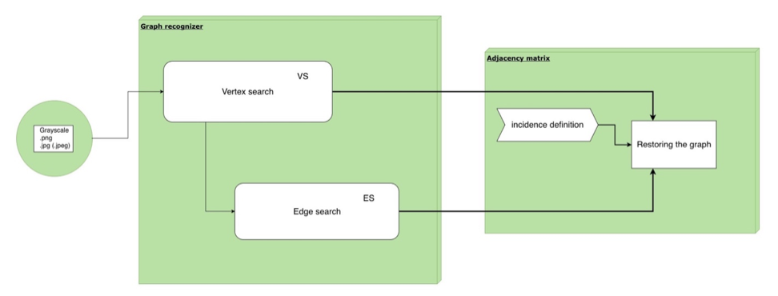

Программа разбита в несколько этапов:

1.  На вход поступает изображение форматом .png .jpg .jpeg и др. и
    запускается скрипт с предобработкой (удаление шумов и инвертирование
    цветов в 1 канал).

2.  VS: На изображении с помощью каскадов Хаара ищем вершины графа,
    затем запускаем фильтрацию в 2 этапа (СНС и дополнительный
    алгоритмический фильтр), сохраняем полученные данные файл для
    следующего этапа.

3.  ES: Определяем начало движения Tracker у каждой вершины графа с
    помощью дополнительных прямоугольников.

4.  ES: Запускаем Tracker для определения какие вершины соединены.

5.  Составляется удобный формат для дальнейшей визуализации.

**Предобработка**
=================

**Фильтрация с помощью сверточных ядер**
----------------------------------------

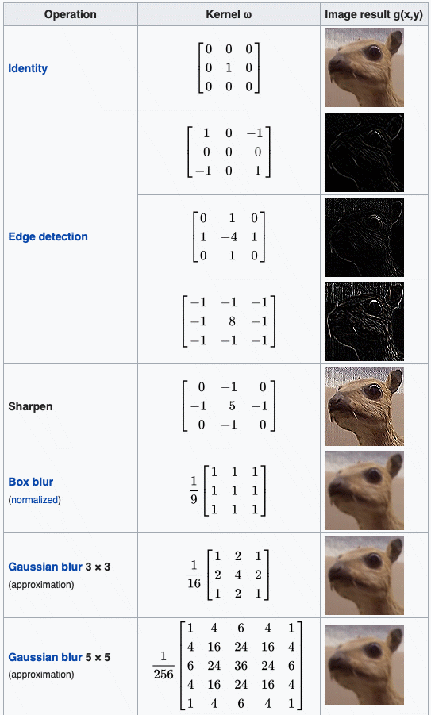Изначально предполагалось использовать сверточные ядра для обработки изображения, вот примеры свертночных ядер:

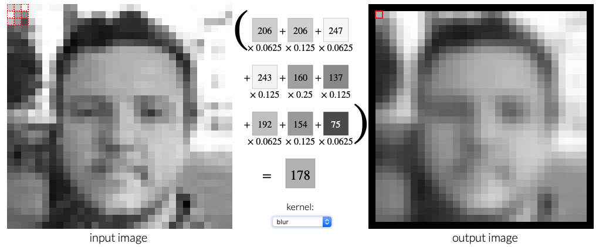

### Основа программы:

Создано было 3 программы с различными модификациями. На вход программам
подается матрица-ядро, которое применяется к изображению.

Результат работы программы:

1 программа | 1 канал (Edge detection 2 type)
------------ | -------------
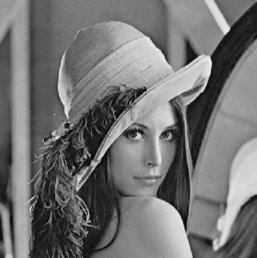 | 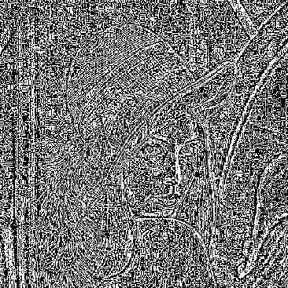

2 программа | 3 канала  (Edge detection 3 type)
------------ | -------------
| 

**Итоговая программа предобработки изображения**
------------------------------------------------

После анализа входных изображений пришлось упростить предобработку до
применения фильтра Гаусса и переводом в один канал.

Изображение подается на вход с префиксом green/white:

1.  Если изображение больше, чем 900 пикселей в ширине или высоте, то
    уменьшаем размер до 900x900 (размер на высоте или ширине должен быть
    меньше или равен 900). Если изображение не квадратное, то сохраняя
    пропорции уменьшаем самую большую сторону до 900.

2.  Green -- изображение с доски. Этапы: переводим в 1 канал, убираем
    шумы и инвертируем цвета (чтобы выделить черным контур графа)

3.  White -- изображение с листка бумаги. Этапы: переводим в 1 канал.

**Поиск вершин графа**
======================

Обработанное изображение подается на алгоритм, который состоит из
несколько шагов:

1.  Каскады Хаара

2.  Фильтр, реализованный с помощью сверточной нейронной сети

3.  Алгоритмический фильтр

Рассмотрим каждый из этапов более детально.

**Почему каскады Хаара?**
-------------------------

Для поиска окружностей было сделано 5 алгоритмов:

1.  Simple Blob Detector (2 варианта)

2.  MSER Blob Detector (2 варианта)

3.  Hough Circles

### **Simple Blob Detector**
В двух вариантах они показали себя очень
плохо.

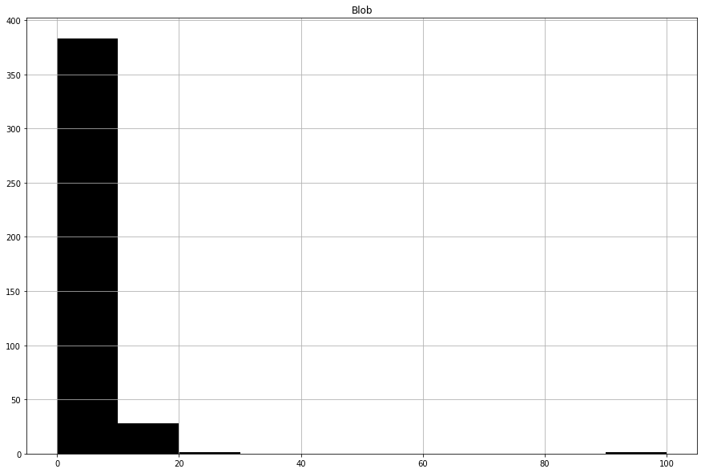

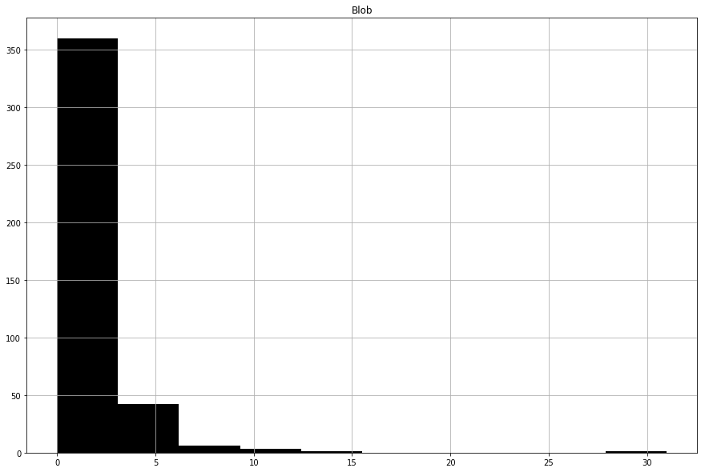

В обоих случаях при различных параметрах число нераспознанных вершин
больше 300! Этот алгоритм можно сразу отложить.

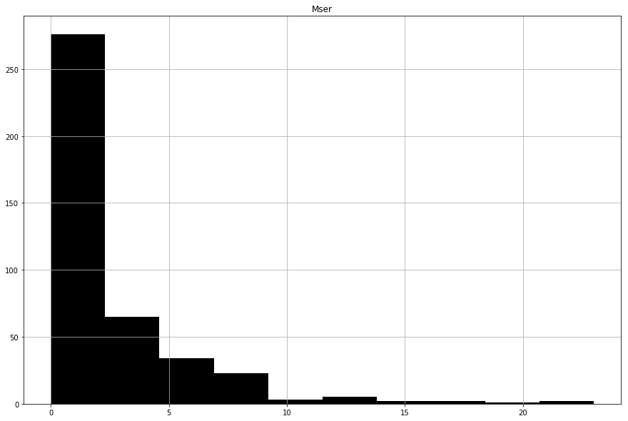

**MSER Blob Detector**

2 алгоритма MSER Blob Detector с разными параметрами показывают лучше
результат, чем Simple Blob Detector, но число нераспознанных вершин
остается недопустимым.

### **Hough Circles**

Единственный минус данного алгоритма -- это параметры, которые
необходимо подбирать для каждой фотографии индивидуально, если данные
проблемы опустить, то данный алгоритм может конкурировать с каскадами
Хаара.

Сразу можно заметить, что при определенных значениях 0 значений нету,
значит Hough Circle распознал либо шум, либо вершину. Результат очень
неплохой, но для реализации он не подходит из-за необходимости подбора
коэффициентов для функции HoughCircles в библиотеке OpenCV.

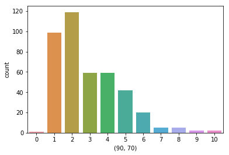

**Каскады Хаара**
-----------------

### **Подготовка данных**

#### **Генерация графов с помощью библиотеки NetworkX**

Изначально было предложено сгенерировать датасет с помощью библиотеки
python networkx.

Пример графа:
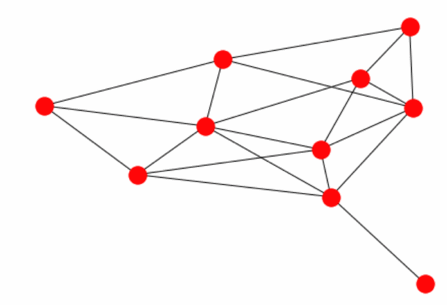

Данный метод не подошел, т.к. обученные каскады Хаара на этом наборе
данных изображений не имеют широкого применения, в отличие от
нарисованных.

#### **Программа для создания набора данных для обучения **

Для успешного обучения потребуется большое количество «отрицательных» и
«положительных» образцов. Для более удобной разметки изображений
используется разработанная программа, которая позволяет получить
изображения вершин графа, путем выделения нужной области в ходе работы
программы.

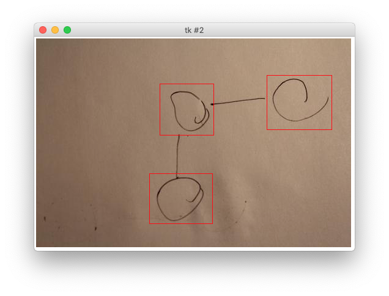

**Пример работы:**

Также с помощью программы можно
сформировать индексный файл с расширением .dat для дальнейшего обучения
каскадов Хаара.

#### **Программа для генерации дополнительного набора данных для обучения **

При малом количестве изображений можно
сгенерировать дополнительные наборы данных путем поворота их на
определенный угол, который задается перед запуском, или на произвольный
угол (от 0 до 180 градусов).

### **Обучение признаков Хаара**

Обучение различных моделей Хаара
производилось на облачном вычислительном ресурсе: Google Cloud Platform,
на виртуальной машине Ubuntu 16.04 LTS.

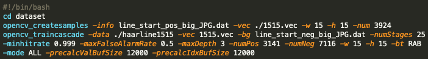
Обучение каскадов осуществлялось следующим
образом: с помощью данной консоли запускали скрипт **haar1515.sh**,
который запускал обучение. В этом файле прописаны команды для запуска
обучения, фото ниже:

Для того, чтобы избежать постоянного подключения по ssh к удаленной
машине, скрипт запускался как demon в Ubuntu, т.е. в фоновом режиме и с
записью выходной информации в файл с расширением .txt, с помощью
следующей команды:

nohup ./haar1515.sh \>\$HOME/haar1515.txt 2\>&1 \< /dev/null &

Для отслеживания аппаратных ресурсов и прогресса применялась утилита
**htop**:

C помощью **htop** можно отследить потребляемую оперативную память, а
также нагрузку на процессор.

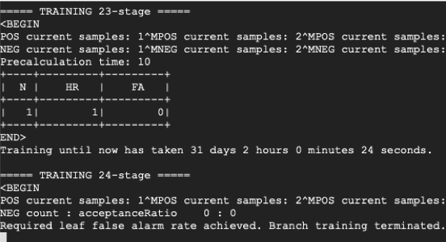
Конечный результат вывода в файл **haar1515.txt**
(последняя стадия обучения)

Каскады Хаара обучаются довольно долго, в данном случае 23 стадия
обучалась 31 день. Это не предел, поэтому каскады Хаара обучались не
более, чем на 25 эпохах, используя 8 ядер и не менее 40 Гб оперативной
памяти.

### **Выбор обученной модели Хаара**

Всего было создано 9 моделей каскадов
Хаара:

#### **Как выбирается лучший каскад?**

Выбор каскада Хаара осуществляется следующим образом:

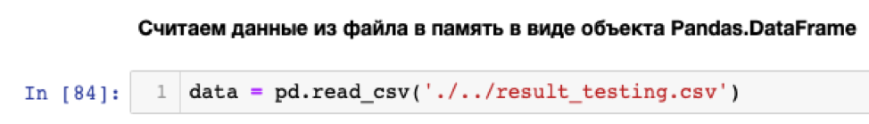
Из-за того, что на каждой картинке было не
менее 2 вершин графа, то выбираем тот каскад, у которого наименьшее
число 0 распознаваний вершин.

Для выявления лучшего каскада, был создан
скрипт, позволяющий протестировать 413 картинок на каждом каскаде и
сохранить данные в csv файл для дальнейшего анализа с помощью библиотеки
pandas и seaborn.

Проанализируем каждый каскад в целом с помощью диаграммы:

С помощью диаграммы находим, что
минимальное число ложных срабатываний (число нераспознанных вершин)
имеет каскад Хаара 20x20 2 типа.

Более детальное представление:

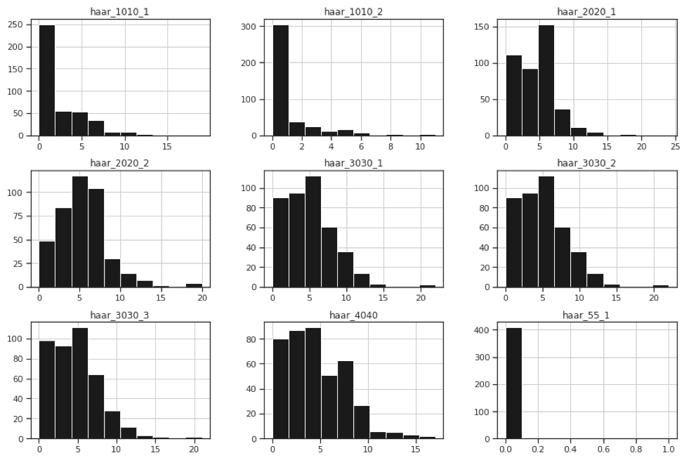

Лучшая обученная модель каскадов - Хаар 20x20 2 типа:

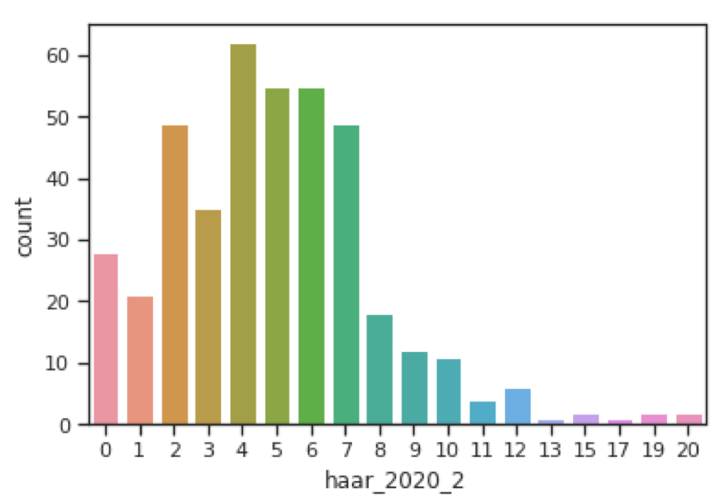

**Фильтр СНС**
--------------

Из-за того, что каскады Хаара иногда выделяют пересечения линий, похожие
на вершину графа, то данные случаи необходимо свести к минимуму с
помощью сверточной нейронной сети. Задача СНС (Сверточной Нейронной
Сети) -- классификация вершин.

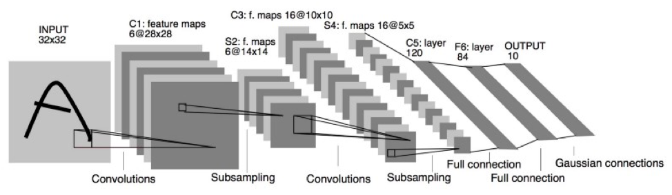
За основу архитектуры нейронной сети была
взята сверточная нейронная сеть LeNet5:

Так как вершина графа является кругом, то для измененной архитектуры СНС
число features maps на каждом этапе свертки примерно такое же, как и для
различных букв алфавита, которые используется для обучения нейронной
сети на изображении.

В результате многочисленных экспериментов
была найдена оптимальная архитектура СНС:

На выходе два нейрона, которые дают вероятностную оценку вершина или не
вершина в %.

Статистика по СНС:

Лучший результат:

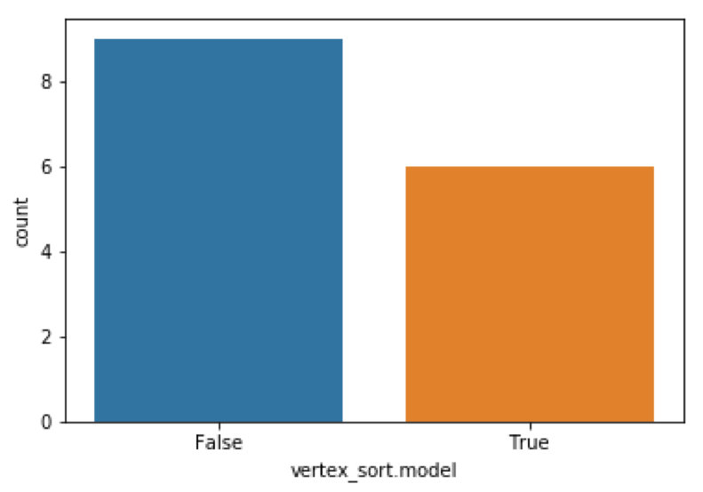

Было использовано 15 фото для анализа фильтра, основанный на нейронной
сети. Общее затраченное время на анализ моделей: 4,5 часа. То, есть
фильтрация, основанная на нейронной сети -- дорогостоящая операция, но
результативная, т.к. на случайных данных 40% фото были доведены до
идеала (идеал -- когда на фото были распознаны все вершины).

**Дополнительный фильтр пересечений**
-------------------------------------

Данный фильтр позволяет избавится от
некоторых случаев пересечения:

Все подобные случаи пересечения учитываются при выполнения работы.

Слева -- пересечение, которое поймал алгоритм, а справа -- результат.

**Поиск начал линий**
=====================

Для того чтобы определить линию, необходимо знать:

-   Точку начала линии

-   Точку пересечения линии с другими

Поиск начал линий с помощью Каскадов Хаара
------------------------------------------

Изначально предлагалось использовать каскады для поиска начал линий.

Лучший результат -- это гистограмма, на которой наименьшее число 0
срабатываний.

Результат выбора:

Проблема:

Любой шум, который есть на изображении (точка, иное множество пикселей)
может стать областью началом линии, поэтому число ложных срабатываний
оказалось достаточно велико. По этой причине пришлось отказаться от
данной идеи.

Поиск точек пересечения с помощью Каскадов Хаара
------------------------------------------------

Предполагалось использовать каскады для поиска пересечений.

Проводилось сравнение с моделями для поиска начал линий.

Результат:

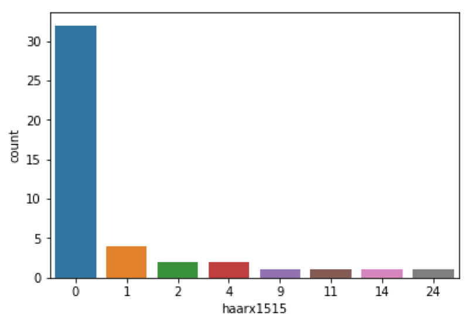

Использование каскадов не подходит из-за малой точности и большой
погрешности. Некоторый процент распознанных точек начал линий и точек
пересечений является ложным срабатыванием, поэтому точность еще ниже,
чем предполагалось.

Поиск начал линий с помощью Hough Lines
---------------------------------------

Используя алгоритм HoughLinesP из библиотеки OpenCV, удалось достичь
очень хорошего результата, но у него есть один большой минус, который не
позволил его использовать в данной задаче.

Этапы алгоритма:

1.  С помощью алгоритма Хаара и дополнительных фильтров определяем, где
    находятся вершины.

2.  Далее расширяем квадрат области с вершиной на среднее значение,
    вычисленное по среднему значению длины и ширины для данной области.

3.  Точки линий, обнаруженные алгоритмом HoughLinesP, которые находятся
    между квадратной областью Хаара и дополнительного квадрата, являются
    точками начала линий.

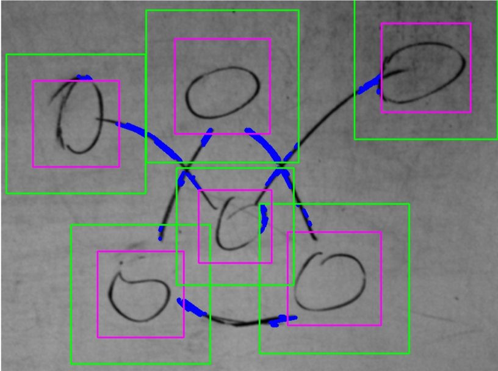

Результат:

На основе алгоритма HoughLinesP был создана программа, которая позволяет
разбить линию после обработки алгоритмом Canny из OpenCV на маленькие
линии, чтобы потом срастить линии в одну.

Этапы на примере:

1) Обработанное изображение с доски | 2) Алгоритм Canny
------------ | -------------
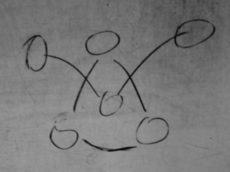 | 
3)  Алгоритм HoughLinesP | 4)  Алгоритм склеивания линий
 | 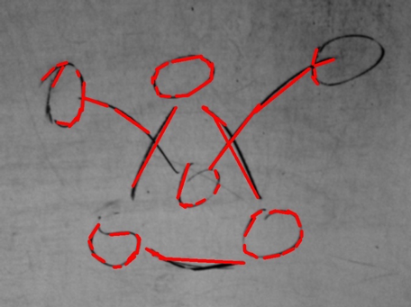

Данный метод безусловно эффективен для конкретного изображения, но для
любого другого необходимо подбирать коэффициенты для склеивания линий.
Именно по этой причине эта программа не подошла.

Ни один из предложенных алгоритмов не подходит, поэтому был создан свой
алгоритм Tracker, который пробегается по пикселям линии. По этой причине
поиск начал линий было решено как пересечения вспомогательных квадратов
на основе размеров квадрата Хаара с пикселями линии графа -- линий
движения умного ползунка (Tracker).

**Tracker**
===========

Поиск начал линий
-----------------

Этапы:

1) Обработанное изображение | 2) Алгоритм Canny
------------ | -------------
 | 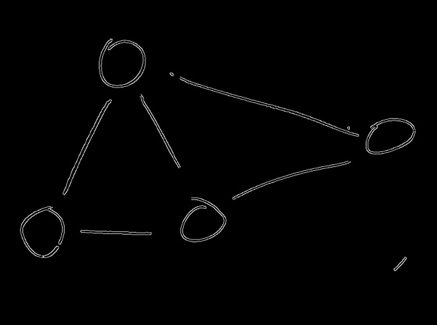
3) С помощью свертки соединяем 2 линии после алгоритма Canny  |  4) Уменьшаем размер линии до малого числа пискселей, чтобы не было разрыва
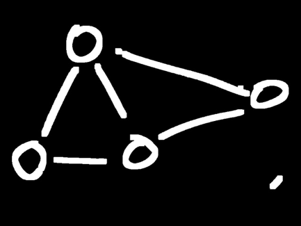 | 
5) То множество пикселей, которое попало в область дополнительных прямоугольников - удаляется  |  6) Белая часть - это множество точек пересечения, поэтому выбираем центральную точку пересечения для каждой области
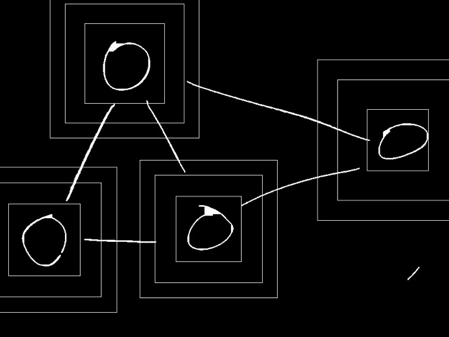 | 
7) Получаем точки начал линий  |  8) После удаления в 5 пукте находим линии движения Tracker ("Умного ползунка")
 | 

С помощью данного алгоритма мы можем «пройтись по линиям» графа.

Точка начала линий определяется с помощью дополнительных квадратов на
основе выделенной области Хаара.

Результат:

Движение Tracker
----------------

### Условие соединенности вершин
Для того, чтобы подтвердить, что линия принадлежит данным двум верши-нам, необходимо, чтобы Tracker прошел от одной точки к другой, хотя бы один раз.

### Как двигается Tracker?
Движение основано на пересечении окружности с линией «дорогой» Tracker.

#### Алгоритм:
1.	На точке начала линии, рисуется красная окружность
2.	Находится ее пересечение с пикселями линии (дороги) Tracker
3.	Множество точек пересечения приводится к одной точке, в которой рисуется новая окружность (приведение к одной точке такое же как и у поиска начал линий)
4.	Циклически выполняем 2-3, до тех пор, пока не встретим:
  - Другую точку начала линии
  - Конец линии или окончание дороги

  Движение Tracker | Траектория движения Tracker
  ------------ | -------------
  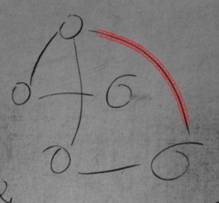 | 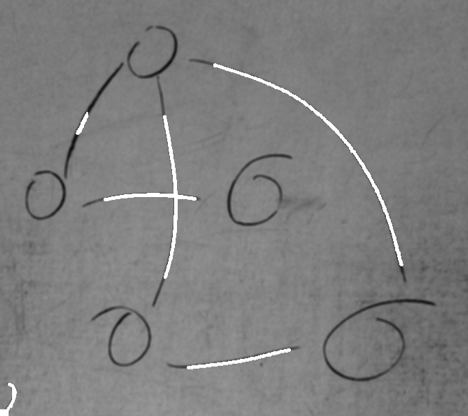

### Что происходит при различных выходах в пункте 4?
Включается прострел Tracker, который проверяет попадает ли линия в центр главного (красного) прямоугольника, который является границами распо-знанной вершины, используя координаты последних двух окружностей для построения прострела. Более подробно в главе про Shoot Tracker.

### Tracker Shoot
Данный алгоритм начинает работать после встречи одно из условий 4 пункта алгоритма движения Tracker.
Рассмотрим работу на примере.

Сверху на картинке изображен прострел для потверждения того, что линия приходит к вершине, а не уходит в сторону. Для прострела используется 2 координаты центра последних окружностей для построения линии и вычисления коэффициента k и b для рассчета.
- **Белая окружность** – точка начала линии.
- **Красная окружность** – последний шаг Tracker.
- При отсутствии белой оркжности, т.е. точки начала линии, используется координаты 2 последних красных окружностей.

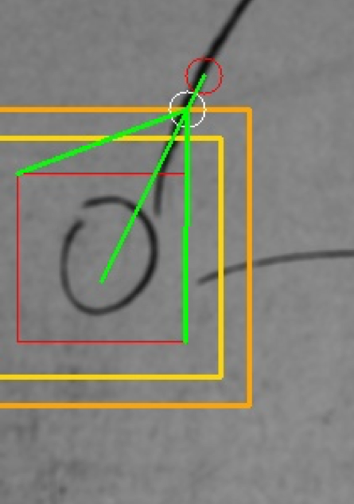

**Функция прямой: y=kx+b**

**Искомый коэффициент: k=(y-b)/x**

Используя координаты крайних точек главной области вершины (красный прямоугольник) и координату начала линии (в случае ее отсутсвия – последнюю красную окружность) определяем границы значения коэффициента k для прямой, которая должна попасть в область, где находится вершина.

Используя координаты центров белого и красного круга определяем функцию прямой, а затем искомый коэффициент.

Если коэффициент находится в допустимой области, то картинка будет такая же как слева.

### Основные проблемы и их решения
1.	При разрыве линии алгоритм движения Tracker может остановиться, т.к. попадет в провал точка пересечения окружности с траекторией Tracker.
  - [x] Решение – сделать динамическое расширение окружности на каждом шаге Tracker
2.	При пересечении линий алгоритм не работает, т.к. имеет много пересечений с траекторией Tracker
  - [x] Решение – сделать динамическое расширение окружности на каждом шаге Tracker
3.	Определение точек начала линии иногда дает плохой результат, если какая-либо линия проходит рядом с областью вершины (пример ниже).
  - [x] Решение – двойная верификация вершин, т.е. движение Tracker производится сначала в одну сторону, а потом в другую.

**Пример проблемы:**
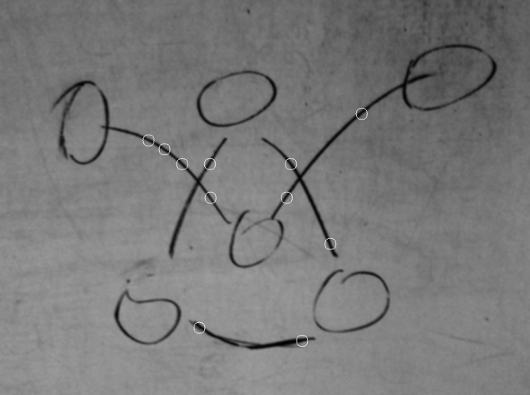

Выводы
======

Данная работа посвящалась оцифровке графов, если граф без пересечений и без весов, то задача выполнена, иначе – есть над чем работать.

### Результаты на текущей стадии

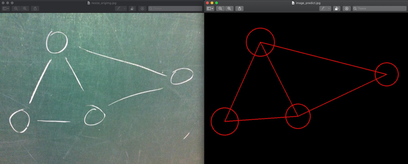

**С учетом всех недостатков, работа на этом не заканчивается и поэтому в новой версии Tracker 2.0 будет более продуманная логика движения и Tracker Shoot.**

Литература
==========
1.	https://www.pyimagesearch.com/2017/08/21/deep-learning-with-opencv/
2.	https://habr.com/ru/post/309508/
3.	https://www.asozykin.ru/courses/nnpython-intro
4.	Курсы по нейронным сетям от Deep Learning Course при МФТИ

**Приложение**
==============

**Определения**
---------------

**Алгоритмический язык программирования** - формальный язык,
используемый для записи, реализации и изучения алгоритмов. В отличие от
большинства языков программирования, алгоритмический язык не привязан к
архитектуре компьютера, не содержит деталей, связанных с устройством
машины.

**Объектно-ориентированное программирование** (ООП) - методология
программирования, основанная на представлении программы в виде
совокупности [объектов](https://ru.wikipedia.org/wiki/Объект_(программирование)),
каждый из которых является экземпляром
определенного [класса](https://ru.wikipedia.org/wiki/Класс_(программирование)),
а классы образуют иерархию наследования.

**Функциональное программирование** - раздел дискретной математики и
парадигма программирования, в которой процесс вычисления трактуется как
вычисление значений функций в математическом понимании последних (в
отличие от функций как подпрограмм в процедурном программировании).

**Tkinter, Qt5** - графические библиотеки, позволяющие создавать
программы с оконным интерфейсом.

**Используемые технологии и их описание**
-----------------------------------------

### **Каскады Хаара**

**Признаки Хаара** - признаки цифрового изображения, используемые
в распознавании образов.

Для поиска объектов по их ключевым признакам используется метод П.Виолы
и М.Джонса. Подход использует 4 ключевых концепции:

-   Простные прямоугольные функции, называемые функциями Хаара

-   Интегральное изображение для упрощения поиска

-   Метод машинного обучения AdaBoost

-   Каскадный классификатор для эффективного совмещения множества
    функций

Особенности, которые использовали Виола и Джонс, базируются на вейвлетах
Хаара. Вейвлеты Хаара представляют собой прямоугольные волны одинаковой
длины (один высокий интервал и один низкий интервал). В двух измерениях,
прямоугольная волна являет собой пару соседних прямоугольников - один
светлый и один темный.

**Нейронная сеть**
------------------

Нейронные сети - математические модели, а также их программные или
аппаратные реализации, построенные по принципу организации и
функционирования биологических нейронных сетей - сетей нервных клеток
живого организма.

Существуют различные виды нейронных сетей, которые подразделяются на
сети прямого распространения, сверточные, рекурсивные, развертывающие.
Для решения своих задач мне понадобились сверточные нейронные сети. Они
тоже имеют свою классификацию в зависимости от необходимой цели.

Широко распространены сверточные сети, так как они решают много полезных
задач. Свертка представляет из себя карты признаков (матрицы). У каждой
матрицы есть синаптическое ядро, представляющееся из себя фильтр,
который скользит по всей области предыдущей кары и находит определенные
признаки. В процессе обучения ядро свертки меняется и свертка определяет
разные признаки. Обычно применяют свертки с нечетной размерностью ядер
от 3х3 до 7х7.

Также в сверточных нейронных сетях
присутствует подвыборочный слой (pooling). Цель данного слоя -
уменьшить размерность карт предыдущего слоя. Такая фильтрация помогает
убрать ненужные детали, что предотвращает переобучение. Обычно
используют ядро 2х2. В подвыборочном слое используют либо максимизацию,
либо усреднение. В большинстве случаев используется максимизация
(max-pooling). После чередования сверточных слоев и подвыборочного слоя
следует полносвязный слой, который выполняют определенную задачу в
зависимости от вида нейронной сети.

Выделяют следующие виды сверточных нейронных сетей:

-   Классификация - при обучении задается число различных классов
    изображений, на выходе нейронной сети мы имеем вероятность
    принадлежности к заданным классам.

-   Распознавание объектов - выделение области в котором находится
    объект определенного класса.

-   Определение границ

-   Локализация - поиск объектов на изображении и выделение его размера.

-   Сегментация - разделение всего изображения на классы и выделение
    границ объектов всех классов.

В своем проекте я использовал нейронную сеть для классификации.

**Детектор границ Canny**
-------------------------

Детектор границ Canny является одним из самых лучших детектеров. Он ищет
пиксели, в которых достигается локальный максимум градиента в
направлении вектора градиента. У детектора следующие этапы:

1.  Перевод изображения в оттенки серого. Это позволяет оставить только
    один канал вместо трех в цветном изображении. Можно использовать
    различные цветовые модели, такие как YUV, HSV, HSL.

2.  Сглаживание. На этом этапе мы размываем изображение для удаления шума. Для этого воспользуемся фильтром Гаусса.

3.  Поиск градиентов. Отмечаются границы в точках, где градиент
    изображения приобретает максимальное значение.

4.  Подавление не максимумов. Пикселями границ объявляются пиксели, в
    которых достигается локальный максимум градиента в направлении
    вектора градиента. Значение направления должно быть кратно 45°.

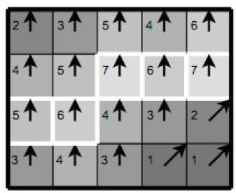

Принцип подавления проиллюстрирован на
рисунке выше. Почти все пиксели в примере «имеют ориентацию вверх», поэтому значение градиента в этих точках будет сравнено с ниже- и вышерасположенными пикселями. Обведённые белым контуром пиксели останутся в результирующем изображении, остальные - будут подавлены.

5.  Двойная пороговая фильтрация. Определяет находится ли граница в данной точке изображения. Чем меньше порог, тем больше границ будет находиться, но тем более восприимчивым к шуму станет результат, выделяя лишние данные изображения. Наоборот, высокий порог может проигнорировать слабые края или получить границу фрагментами. Выделение границ Canny использует два порога фильтрации: если значение пикселя выше верхней границы - он принимает максимальное значение (граница считается достоверной), если ниже - пиксель подавляется, точки
со значением, попадающим в диапазон между порогов, принимают
фиксированное среднее значение (они будут уточнены на следующем этапе).

6.  Трассировка области неоднозначности. Выделение групп пикселей, получивших на предыдущем этапе промежуточное значение, и отнесению их к границе или к их подавлению. Пиксель добавляется к группе, если он соприкасается с ней по одному из 8-ми направлений.
